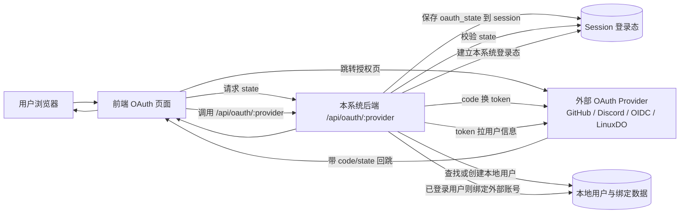
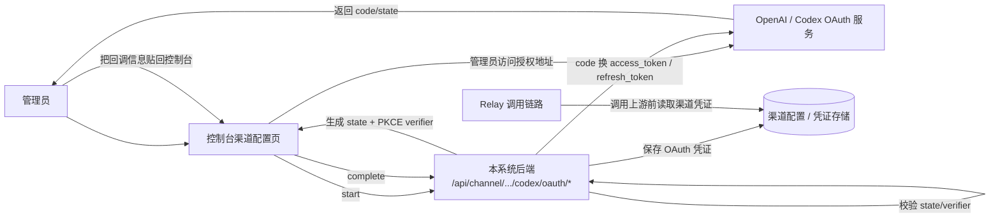

# 10 - 认证、安全与权限模型

## 为什么这一节值得单独写

这个项目不是“只有一个 API Key 校验”的简单代理。

从代码看，它同时维护了三套身份边界：

1. 平台控制台用户身份
2. Relay 调用令牌身份
3. 高风险操作的二次安全验证身份

这也是为什么 `router/api-router.go`、`middleware/auth.go`、`controller/passkey.go`、`controller/twofa.go` 会占据不小的复杂度。

## 三层身份平面

### 1. 控制台用户身份

控制台侧主要依赖 Session 登录态，核心中间件在 `middleware/auth.go`：

- `UserAuth()`
- `AdminAuth()`
- `RootAuth()`

特点不是“只看 session 有没有用户”，而是还会校验：

- `username / role / status` 是否有效
- `New-Api-User` 请求头是否与当前登录用户 ID 一致
- 被禁用用户是否被拦截
- 角色是否满足最小权限要求

也就是说，后台 API 的权限边界是：

```text
Session / AccessToken
  -> User/Admin/Root 中间件
  -> New-Api-User 绑定校验
  -> 具体路由组权限
```

### 2. Relay 调用身份

数据面主要依赖调用令牌，而不是控制台 session。

典型入口在：

- `/v1/*`
- `/v1beta/*`
- `/mj/*`
- `/suno/*`

这些路由大多通过 `TokenAuth()` 进入，再交给 `Distribute()` 做模型和渠道分发。

这说明项目在架构上明确把：

- “谁能登录平台”
- “谁能调用模型接口”

拆成了两类身份系统。

### 3. 混合身份与只读令牌

项目里还有两种折中形态：

- `TokenOrUserAuth()`：同一个接口既允许控制台用户访问，也允许 API 调用方访问
- `TokenAuthReadOnly()`：只做宽松令牌存在性校验，允许查询只读资源

这对“控制台内嵌 playground / 查询接口 / 兼容旧接口”很重要。

## 权限层级

从路由组织看，权限大致分成三层：

1. `User`
   用户自助信息、个人设置、充值、订阅、Passkey、2FA、OAuth 绑定。
2. `Admin`
   用户管理、渠道管理、任务查看、日志、套餐管理等运营能力。
3. `Root`
   系统选项、性能操作、自定义 OAuth Provider、敏感配置、渠道密钥查看等高危能力。

这不是“一个 admin 包打天下”的设计，而是比较明确地区分了运营权限和系统权限。

## 多种登录与绑定方式

### 用户名密码

基础登录链路包括：

- 注册
- 密码登录
- 邮箱验证
- 找回密码

这些大多在 `router/api-router.go` 的 `/api/user/*` 下。

### OAuth

OAuth 不是单一 provider，而是两层体系：

1. 内建 provider
   如 GitHub、Discord、OIDC、LinuxDO。
2. 自定义 provider
   通过 `custom_oauth_providers` 和 `user_oauth_bindings` 两张表扩展。

`controller/oauth.go` 里还能看到几个关键点：

- `state` 用于 CSRF 防护
- 已登录用户进入 bind 流程，未登录用户进入登录/注册流程
- 兼容旧 provider user id 的迁移逻辑

所以这里不是“接几个 OAuth 按钮”，而是一套可扩展的身份接入层。

## OAuth 在这个项目里到底扮演什么角色

这里最容易混淆的一点是：仓库里出现了两类“OAuth”。

### 1. 用户身份 OAuth

`oauth/` 目录下这套主流程，作用是：

- 让 GitHub、Discord、OIDC、LinuxDO、Telegram、WeChat 等外部身份系统为本平台用户做认证
- 让用户使用第三方账号登录本系统
- 让已登录用户把第三方账号绑定到本系统账号

它不是“本系统对外提供 OAuth 服务”，而是“本系统作为 OAuth Client，接入外部身份提供方”。

这点可以从几处代码直接确认：

- 路由入口是 `GET /api/oauth/:provider`，位于 `router/api-router.go`
- 统一回调控制器是 `controller.HandleOAuth`
- 处理步骤是“校验 state -> 用 code 换 token -> 拉 provider 用户资料 -> 查找或创建本地用户 -> 建立登录态”
- 自定义 provider 绑定关系单独落在 `user_oauth_bindings` 表

换句话说，这部分是：

```text
外部身份系统 -> 帮助用户登录 / 绑定 -> 本系统
```

而不是：

```text
本系统 -> 作为 OAuth 提供方 -> 给别的业务系统登录
```

### 2. 渠道凭证 OAuth

仓库里还有一套单独的 `Codex OAuth`，位于：

- `controller/codex_oauth.go`
- `service/codex_oauth.go`

这一套不是用户登录，也不属于平台账户体系；它的作用是：

- 管理员为某个上游渠道发起 OAuth 授权
- 用授权码交换 access token / refresh token
- 把得到的上游凭证保存到渠道配置中，供 relay 调用上游模型时使用

所以它的方向是：

```text
本系统 -> 接入上游平台 -> 获得渠道凭证
```

而不是：

```text
外部系统 -> 通过本系统 OAuth -> 接入本系统
```

## 两类 OAuth 的关系图

### 图 1：用户登录/绑号 OAuth



这张图表达的是：第三方账号是“登录本系统的身份证明来源”，最终登录态仍然建立在本系统里。

### 图 2：Codex 渠道 OAuth



这张图表达的是：这里的 OAuth 服务于“渠道接入上游”，不是服务于“用户登录本平台”。

## 一句话结论

如果只问“这个项目中的 OAuth 是干什么的”，最准确的回答是：

- 主体上的 OAuth：让外部身份系统接入本系统，为本系统用户提供登录、注册联动和账号绑定能力
- 额外的一小部分 OAuth：让本系统接入上游平台，为渠道获取和刷新访问凭证

它不是“让外部业务系统通过 OAuth 接入本系统用户体系”的设计。

### Passkey / WebAuthn

Passkey 相关流程集中在 `controller/passkey.go`，包括：

- 注册 begin / finish
- 登录 begin / finish
- 已登录用户的二次验证 begin / finish
- 删除绑定

它的特征是：

- 既支持把 Passkey 作为登录方式
- 也支持把 Passkey 作为高危操作的 step-up verification

这比“只做免密登录”更平台化。

### 2FA

`controller/twofa.go` 展示的是另一条安全链：

- 初始化 TOTP
- 返回二维码和 backup codes
- 启用 2FA
- 禁用 2FA
- 备用码再生

所以项目在账户安全上同时保留了：

- Passkey
- TOTP 2FA
- OAuth
- Password

属于明显的平台账户体系，而不只是给 Relay 配一个 Token。

## Step-Up Verification

这是当前文档里最值得补的一块。

项目并不满足于“用户已登录”，而是对部分高风险操作要求再验证一次。

核心机制在：

- `middleware/secure_verification.go`
- `controller/secure_verification.go`

模型是：

1. 用户先完成一次 `2fa` 或 `passkey` 验证
2. 验证成功后在 session 中写入短期标记
3. `SecureVerificationRequired()` 中间件检查标记是否存在且未过期
4. 高危接口才允许继续执行

目前代码里一个很典型的受保护能力是渠道密钥读取：

- `POST /api/channel/:id/key`

它要求：

- Root 权限
- 限流
- 禁止缓存
- 二次安全验证

这说明项目对“后台能看到上游密钥”这件事做了额外防护，而不只是靠角色控制。

## 为什么这块对理解项目很关键

如果只看 Relay，很容易把它理解成“API 网关”。

但把认证和安全模型加进来之后，可以更准确地理解成：

```text
AI Gateway
  + 控制台账户系统
  + 多身份接入
  + 高危操作保护
  + 用户/管理员/Root 分层权限
```

这也是为什么这个仓库的复杂度，一部分并不在 provider adapter，而是在平台侧身份和安全设计。
