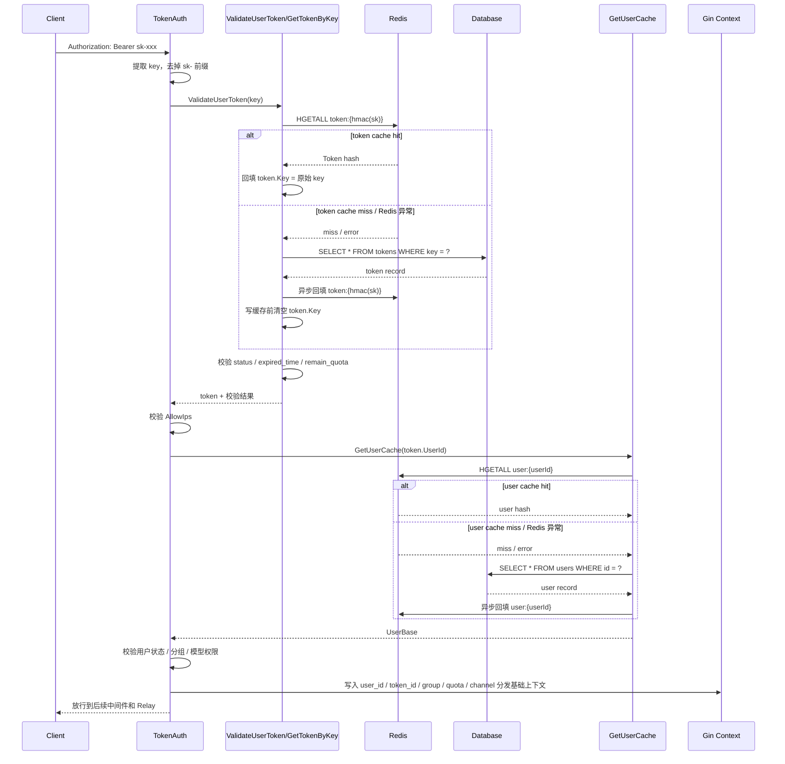
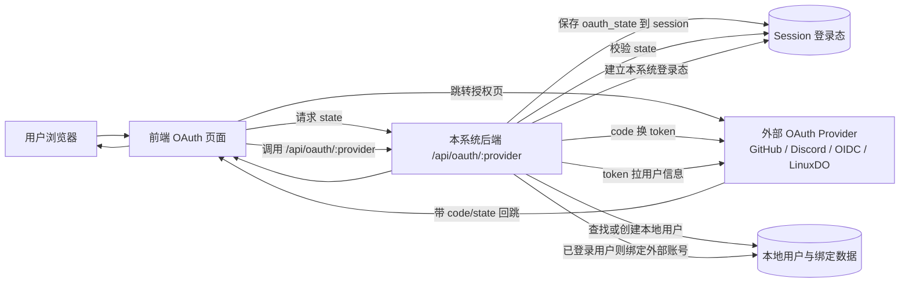
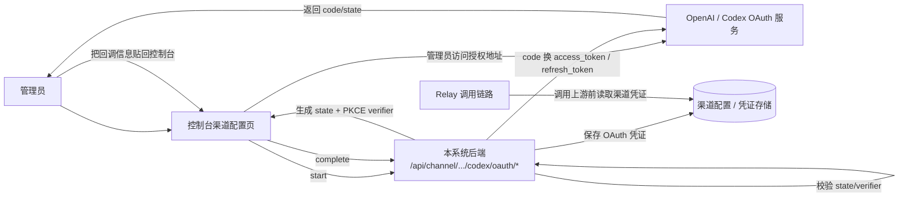

# 10 - 认证、安全与权限模型

## 为什么这一节值得单独写

这个项目不是“只有一个 API Key 校验”的简单代理。

从代码看，它同时维护了三套身份边界：

1. 平台控制台用户身份
2. Relay 调用令牌身份
3. 高风险操作的二次安全验证身份

这也是为什么 `router/api-router.go`、`middleware/auth.go`、`controller/passkey.go`、`controller/twofa.go` 会占据不小的复杂度。

## 三层身份平面

### 1. 控制台用户身份

控制台侧主要依赖 Session 登录态，核心中间件在 `middleware/auth.go`：

- `UserAuth()`
- `AdminAuth()`
- `RootAuth()`

特点不是“只看 session 有没有用户”，而是还会校验：

- `username / role / status` 是否有效
- `New-Api-User` 请求头是否与当前登录用户 ID 一致
- 被禁用用户是否被拦截
- 角色是否满足最小权限要求

也就是说，后台 API 的权限边界是：

```text
Session / AccessToken
  -> User/Admin/Root 中间件
  -> New-Api-User 绑定校验
  -> 具体路由组权限
```

### 2. Relay 调用身份

数据面主要依赖调用令牌，而不是控制台 session。

典型入口在：

- `/v1/*`
- `/v1beta/*`
- `/mj/*`
- `/suno/*`

这些路由大多通过 `TokenAuth()` 进入，再交给 `Distribute()` 做模型和渠道分发。

这说明项目在架构上明确把：

- “谁能登录平台”
- “谁能调用模型接口”

拆成了两类身份系统。

### Relay Token 校验与缓存链路

这里还有一个很容易误解的点：

- `/v1/*` 请求进来后，项目确实会校验 `sk-xxx`
- 但不是“每次都直接查数据库”

实际链路是：

```text
TokenAuth()
  -> 从 Authorization / 兼容 header 中提取 sk-xxx
  -> 去掉 sk- 前缀
  -> ValidateUserToken(key)
  -> GetTokenByKey(key, false)
  -> 优先查 Redis
  -> Redis miss 或 Redis 异常时回源数据库
  -> DB 命中后异步回填 Redis
```

也就是说，这里的设计是：

- token 鉴权：`Redis 优先，DB 兜底`
- user 基础信息读取：也是 `Redis 优先，DB 兜底`
- 当前没有看到专门给 token 做“全量进程内内存缓存”的实现

所以当 Redis 正常启用时，大多数 `/v1/chat/completions` 请求不会每次都打数据库查 token。

### TokenAuth 时序图

下面这张图把 `TokenAuth -> token cache -> user cache -> context` 的实际顺序串起来了：



这张图对应的重点是：

- token 校验和 user 基础信息读取都优先走 Redis
- 两层缓存 miss 时才回源 DB
- token cache 和 user cache 都是在 DB 成功读取后异步回填
- `TokenAuth()` 的目标不只是“判断 token 存不存在”，而是把后续 relay 所需的大部分身份上下文提前准备好

### `token:{hmac(sk)}` 在 Redis 中保存什么

token 缓存不是把整条记录序列化成一个 JSON string，而是存成一个 Redis Hash：

```text
key: token:{hmac(sk)}
type: hash
```

其中：

- Redis key 不是明文 `sk-xxx`
- 代码会先对 token 做 HMAC，再作为 Redis key 的一部分

同时写缓存前还会主动执行一次 `token.Clean()`，把结构体里的 `Key` 清空后再写入 Redis。

这意味着：

- Redis 不保存明文 token
- Redis key 是 `hmac(sk)`
- Redis value 里 `Key` 字段也是空字符串

### Hash 中的字段

这个 hash 保存的是 `model.Token` 结构体的大部分字段，字段名直接使用 Go struct 字段名，值按字符串形式写入。

通常会包含：

- `Id`
- `UserId`
- `Key`
- `Status`
- `Name`
- `CreatedTime`
- `AccessedTime`
- `ExpiredTime`
- `RemainQuota`
- `UnlimitedQuota`
- `ModelLimitsEnabled`
- `ModelLimits`
- `AllowIps`
- `UsedQuota`
- `Group`
- `CrossGroupRetry`

其中有两个细节需要单独强调：

1. `Key`

- 这个字段会被主动清空后再写入 Redis
- 所以 Redis 里的 `Key` 不是明文 `sk-xxx`
- 读取缓存后，程序会把本次请求里传入的原始 key 再补回 `token.Key`

2. `DeletedAt`

- `DeletedAt` 不会写入 Redis
- `RedisHSetObj()` 明确跳过了 `gorm.DeletedAt`

因此逻辑上可以把 Redis 中的 token cache 理解成：

```text
HGETALL token:{hmac(sk)}
Id=123
UserId=45
Key=
Status=1
Name=my-token
CreatedTime=1710000000
AccessedTime=1710001234
ExpiredTime=-1
RemainQuota=998877
UnlimitedQuota=false
ModelLimitsEnabled=true
ModelLimits=gpt-4o,gpt-4.1
AllowIps=1.2.3.4/32
UsedQuota=112233
Group=default
CrossGroupRetry=false
```

### 为什么这些字段要缓存下来

这些字段基本覆盖了 token 鉴权阶段所需的核心信息：

- `Status`、`ExpiredTime`、`RemainQuota`、`UnlimitedQuota`
  用于判断 token 是否可用
- `AllowIps`
  用于 IP 白名单校验
- `Group`、`CrossGroupRetry`
  用于分组和后续渠道重试行为
- `ModelLimitsEnabled`、`ModelLimits`
  用于模型访问限制
- `UserId`
  用于继续加载用户信息、额度和上下文

换句话说，Redis 里的这份 token hash 本质上就是“支撑 `TokenAuth()` 快速完成鉴权的一份缓存快照”。

### 3. 混合身份与只读令牌

项目里还有两种折中形态：

- `TokenOrUserAuth()`：同一个接口既允许控制台用户访问，也允许 API 调用方访问
- `TokenAuthReadOnly()`：只做宽松令牌存在性校验，允许查询只读资源

这对“控制台内嵌 playground / 查询接口 / 兼容旧接口”很重要。

## Relay 输入安全：敏感词检查

除了用户身份、令牌身份和二次验证，这个项目还在 relay 入口前做了一层输入内容拦截。

实现位置主要是：

- `controller/relay.go`
- `service/sensitive.go`
- `service/str.go`
- `setting/sensitive.go`
- `model/option.go`

### 检查发生在什么时候

在 `controller/relay.go` 中，请求体完成解析、校验并生成 `RelayInfo` 之后，系统会先判断当前是否需要做 prompt 敏感词检查：

- `setting.ShouldCheckPromptSensitive()`
- 如果启用，则从请求中构造 `meta.CombineText`
- 然后调用 `service.CheckSensitiveText(meta.CombineText)`

如果命中敏感词，请求会在真正访问上游模型之前被中止，并返回 `sensitive_words_detected`。

也就是说，这里的定位不是“模型返回后再审查”，而是“发送到上游前的前置拦截”。

### 检查是怎么做的

敏感词匹配不是逐条正则扫描，而是基于 AC 自动机（Aho-Corasick）：

- `service.SensitiveWordContains()` 会先把待检测文本转成小写
- `service.AcSearch()` 会把词表也规范化为小写
- `service.getOrBuildAC()` 会按词表内容生成缓存 key，并缓存已构建的自动机
- `MultiPatternSearch(..., true)` 允许在命中后提前返回

这意味着它具备几个明显特征：

- 大小写不敏感
- 适合多关键词匹配
- 词表不变时不会为每个请求都重新构建匹配器

当前主要检查文本内容。`service.CheckSensitiveMessages()` 中对 `image_url` 仍是 `TODO`，说明图像地址本身暂未纳入这套敏感词检测。

### 词表从哪里来

词表来自系统配置项 `SensitiveWords`，而不是单独的本地词库文件。

默认值定义在 `setting/sensitive.go`：

```go
var SensitiveWords = []string{
    "test_sensitive",
}
```

但这只是启动时的默认内存值。项目初始化选项时，会把它写入 `OptionMap`，随后再从数据库 `options` 表加载覆盖：

- `model.InitOptionMap()` 会注册 `SensitiveWords`
- `loadOptionsFromDatabase()` 会读取数据库中的 option 记录
- `updateOptionMap()` 在处理 `SensitiveWords` 时调用 `setting.SensitiveWordsFromString(value)`

因此在真实部署中，实际生效的词表通常来自数据库中的 `options.key = "SensitiveWords"` 这一项。

### 配置格式

`SensitiveWords` 的值不是 JSON 数组，而是“多行字符串，每行一个关键词”。

`setting.SensitiveWordsFromString()` 的处理规则是：

- 按换行拆分
- 对每一行做 `TrimSpace`
- 忽略空行

所以一个典型值可以写成：

```text
spam
gambling
fake_id
test_sensitive
成人内容
暴力
政治敏感词
```

如果从接口或数据库角度看，它保存成一条普通字符串记录，例如：

```json
{
  "key": "SensitiveWords",
  "value": "spam\ngambling\nfake_id\ntest_sensitive\n成人内容\n暴力\n政治敏感词"
}
```

### 在哪里配置

新版前端已经提供了系统设置页面，位置在：

`System Settings -> Security -> Sensitive Words`

对应前端代码：

- `web/default/src/features/system-settings/security/section-registry.tsx`
- `web/default/src/features/system-settings/request-limits/sensitive-words-section.tsx`

这个面板目前暴露了三项：

- `CheckSensitiveEnabled`：总开关
- `CheckSensitiveOnPromptEnabled`：是否检查用户 prompt
- `SensitiveWords`：多行词表

保存后会通过通用 option 更新接口写回后端，再同步到内存配置和数据库 `options` 表。

## 认证相关表的主次关系

如果只看认证与安全子系统，对应的数据主从关系可以概括成：

- 主表：`users`
- 次要表：`tokens`、`passkey_credentials`、`two_fas`、`two_fa_backup_codes`、`user_oauth_bindings`
- 独立配置主表：`custom_oauth_providers`

这里把 `users` 视为认证域的根实体，因为登录态、角色、状态、额度、第三方身份归属最终都收敛到用户。其余几张表都更像围绕用户展开的凭证、绑定或二次验证扩展。

其中 `tokens` 虽然在全库视角可以算一张核心业务表，但在“认证安全”这个专题里，它依然是依附 `users.user_id` 存在的次级身份载体；而 `custom_oauth_providers` 则是另一条独立的配置根，用来承载可扩展的外部身份接入能力。

## 权限层级

从路由组织看，权限大致分成三层：

1. `User`
   用户自助信息、个人设置、充值、订阅、Passkey、2FA、OAuth 绑定。
2. `Admin`
   用户管理、渠道管理、任务查看、日志、套餐管理等运营能力。
3. `Root`
   系统选项、性能操作、自定义 OAuth Provider、敏感配置、渠道密钥查看等高危能力。

这不是“一个 admin 包打天下”的设计，而是比较明确地区分了运营权限和系统权限。

## 用户 Token 与管理员充值权限边界

这一块很容易在产品理解上混淆，因为“API Token 管理”和“用户额度管理”在系统里是两套不同能力。

### 1. 用户 Token 只能按归属人自主管理

`/api/token/*` 这组接口虽然只挂在 `UserAuth()` 下，但控制器实现里每次都会把“当前登录用户 ID”带入查询条件：

- `GetAllTokens`
- `SearchTokens`
- `GetToken`
- `GetTokenKey`
- `UpdateToken`
- `DeleteToken`
- `GetTokenKeysBatch`

这些接口最终都会落到类似 `model.GetTokenByIds(id, userId)`、`GetAllUserTokens(userId, ...)`、`GetTokenKeysByIds(ids, userId)` 这样的模型查询。

这意味着：

- 普通用户只能管理自己的 token
- admin 登录后也只能管理自己名下的 token
- admin 不能通过现有控制台接口直接查看其他用户的完整 `sk-xxx`
- admin 也不能直接替其他用户增删改其 token

换句话说，这里的权限模型不是“管理员可代管所有 API Key”，而是“Token 永远按 `user_id` 归属隔离”。

### 2. 用户自助充值也只作用于自己

用户侧的充值与兑换入口位于 `/api/user/*` 的 self 路由组，例如：

- `POST /api/user/topup`
- `POST /api/user/pay`
- `POST /api/user/stripe/pay`
- `POST /api/user/waffo/pay`

这些流程都基于当前登录用户上下文取 `id`，不是请求里自由指定目标用户。

因此从产品语义上讲：

- 普通用户只能给自己发起充值
- 普通用户不能给别的用户充值

### 3. admin 可以给其他用户调额度，但方式不是“代管 token”

管理员确实可以影响其他用户的“余额/额度”，但入口不是 `/api/token/*`，而是用户管理接口：

- `POST /api/user/manage`

其中 `action = "add_quota"` 时支持三种模式：

- `add`
- `subtract`
- `override`

也就是：

- 给用户加额度
- 给用户减额度
- 直接覆盖用户当前额度

这是一种“用户配额管理”能力，不是“替用户管理 API Token”的能力。前端新版控制台也有对应的管理员额度调整弹窗。

### 4. admin 可以看全站充值记录，也可以补单

管理员在充值体系里还有两项平台级能力：

- `GET /api/user/topup`
  查看全平台充值记录
- `POST /api/user/topup/complete`
  手动把待支付订单补成成功

但要注意，补单并不是“管理员随意指定充值到谁账户”，而是：

- 订单创建时已经绑定 `topups.user_id`
- 补单时只是把那笔订单对应用户的额度补上

所以这里的语义更准确地说是“运营补单”，不是“admin 任意代充到任意账户”。

## 一句话结论

如果只问这套系统当前的权限边界，最简洁的结论是：

- token：每个登录用户只能维护自己的 token，admin 也不能直接查看或维护其他用户的完整 `sk-xxx`
- 自助充值：用户只能给自己发起
- 用户额度调整：admin 可以给其他用户加减额度或覆盖额度
- 充值记录与补单：admin 可以查看全站记录，并把既有订单补单完成

## 多种登录与绑定方式

### 用户名密码

基础登录链路包括：

- 注册
- 密码登录
- 邮箱验证
- 找回密码

这些大多在 `router/api-router.go` 的 `/api/user/*` 下。

### OAuth

OAuth 不是单一 provider，而是两层体系：

1. 内建 provider
   如 GitHub、Discord、OIDC、LinuxDO。
2. 自定义 provider
   通过 `custom_oauth_providers` 和 `user_oauth_bindings` 两张表扩展。

`controller/oauth.go` 里还能看到几个关键点：

- `state` 用于 CSRF 防护
- 已登录用户进入 bind 流程，未登录用户进入登录/注册流程
- 兼容旧 provider user id 的迁移逻辑

所以这里不是“接几个 OAuth 按钮”，而是一套可扩展的身份接入层。

## OAuth 在这个项目里到底扮演什么角色

这里最容易混淆的一点是：仓库里出现了两类“OAuth”。

### 1. 用户身份 OAuth

`oauth/` 目录下这套主流程，作用是：

- 让 GitHub、Discord、OIDC、LinuxDO、Telegram、WeChat 等外部身份系统为本平台用户做认证
- 让用户使用第三方账号登录本系统
- 让已登录用户把第三方账号绑定到本系统账号

它不是“本系统对外提供 OAuth 服务”，而是“本系统作为 OAuth Client，接入外部身份提供方”。

这点可以从几处代码直接确认：

- 路由入口是 `GET /api/oauth/:provider`，位于 `router/api-router.go`
- 统一回调控制器是 `controller.HandleOAuth`
- 处理步骤是“校验 state -> 用 code 换 token -> 拉 provider 用户资料 -> 查找或创建本地用户 -> 建立登录态”
- 自定义 provider 绑定关系单独落在 `user_oauth_bindings` 表

换句话说，这部分是：

```text
外部身份系统 -> 帮助用户登录 / 绑定 -> 本系统
```

而不是：

```text
本系统 -> 作为 OAuth 提供方 -> 给别的业务系统登录
```

### 2. 渠道凭证 OAuth

仓库里还有一套单独的 `Codex OAuth`，位于：

- `controller/codex_oauth.go`
- `service/codex_oauth.go`

这一套不是用户登录，也不属于平台账户体系；它的作用是：

- 管理员为某个上游渠道发起 OAuth 授权
- 用授权码交换 access token / refresh token
- 把得到的上游凭证保存到渠道配置中，供 relay 调用上游模型时使用

所以它的方向是：

```text
本系统 -> 接入上游平台 -> 获得渠道凭证
```

而不是：

```text
外部系统 -> 通过本系统 OAuth -> 接入本系统
```

## 两类 OAuth 的关系图

### 图 1：用户登录/绑号 OAuth



这张图表达的是：第三方账号是“登录本系统的身份证明来源”，最终登录态仍然建立在本系统里。

### 图 2：Codex 渠道 OAuth



这张图表达的是：这里的 OAuth 服务于“渠道接入上游”，不是服务于“用户登录本平台”。

## 一句话结论

如果只问“这个项目中的 OAuth 是干什么的”，最准确的回答是：

- 主体上的 OAuth：让外部身份系统接入本系统，为本系统用户提供登录、注册联动和账号绑定能力
- 额外的一小部分 OAuth：让本系统接入上游平台，为渠道获取和刷新访问凭证

它不是“让外部业务系统通过 OAuth 接入本系统用户体系”的设计。

### Passkey / WebAuthn

Passkey 相关流程集中在 `controller/passkey.go`，包括：

- 注册 begin / finish
- 登录 begin / finish
- 已登录用户的二次验证 begin / finish
- 删除绑定

它的特征是：

- 既支持把 Passkey 作为登录方式
- 也支持把 Passkey 作为高危操作的 step-up verification

这比“只做免密登录”更平台化。

### 2FA

`controller/twofa.go` 展示的是另一条安全链：

- 初始化 TOTP
- 返回二维码和 backup codes
- 启用 2FA
- 禁用 2FA
- 备用码再生

所以项目在账户安全上同时保留了：

- Passkey
- TOTP 2FA
- OAuth
- Password

属于明显的平台账户体系，而不只是给 Relay 配一个 Token。

## Step-Up Verification

这是当前文档里最值得补的一块。

项目并不满足于“用户已登录”，而是对部分高风险操作要求再验证一次。

核心机制在：

- `middleware/secure_verification.go`
- `controller/secure_verification.go`

模型是：

1. 用户先完成一次 `2fa` 或 `passkey` 验证
2. 验证成功后在 session 中写入短期标记
3. `SecureVerificationRequired()` 中间件检查标记是否存在且未过期
4. 高危接口才允许继续执行

目前代码里一个很典型的受保护能力是渠道密钥读取：

- `POST /api/channel/:id/key`

它要求：

- Root 权限
- 限流
- 禁止缓存
- 二次安全验证

这说明项目对“后台能看到上游密钥”这件事做了额外防护，而不只是靠角色控制。

## 为什么这块对理解项目很关键

如果只看 Relay，很容易把它理解成“API 网关”。

但把认证和安全模型加进来之后，可以更准确地理解成：

```text
AI Gateway
  + 控制台账户系统
  + 多身份接入
  + 高危操作保护
  + 用户/管理员/Root 分层权限
```

这也是为什么这个仓库的复杂度，一部分并不在 provider adapter，而是在平台侧身份和安全设计。
