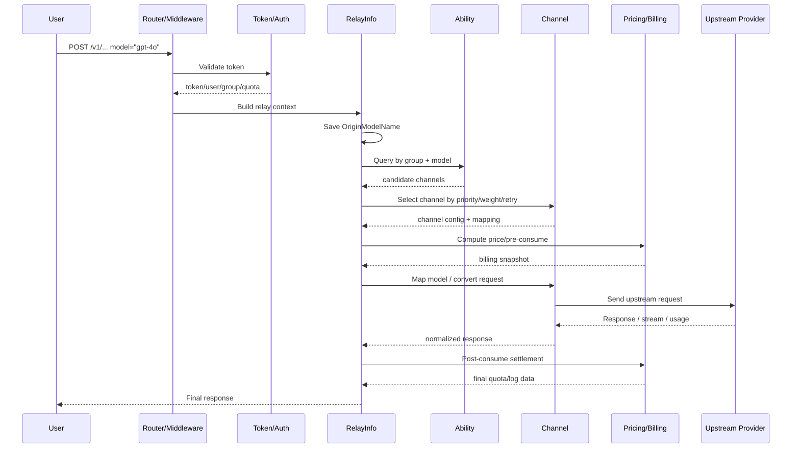

# 13 - 模型元数据、价格来源与请求时序

## 为什么要单独补这一节

前面的架构文档已经分别介绍了：

- `Channel / Ability` 的选路关系
- `Billing / Pricing` 的计费体系
- 请求链路和中间件职责

但从“系统里一个模型到底是什么”这个角度看，仍然有几个很容易混淆的问题：

1. `vendor` 和 `model` 是什么概念
2. 它们和 `channel`、`ability`、请求里的 `model` 字段分别是什么关系
3. 模型广场里的数据、价格和供应商信息到底从哪里来
4. 这些数据什么时候刷新
5. 用户发起一次带 `model` 的请求之后，系统是怎么一路选路到真实上游的

这一节专门把这些问题串起来。

## `vendor` 是什么

这里的 `vendor` 不是 Go 依赖目录里的 `vendor/`，而是“模型供应商 / 厂商 / 作者”元数据。

典型例子：

- OpenAI
- Anthropic
- Google
- DeepSeek
- Moonshot

后端结构定义在 `model/vendor_meta.go`，字段主要包括：

- `name`
- `description`
- `icon`
- `status`

它的职责主要是：

- 给模型做归属分类
- 给模型广场、定价页、排行榜提供展示信息
- 支持按供应商筛选模型

也就是说，`vendor` 解决的是“这个模型是谁家的”。

## `model` 是什么

这里的 `model` 也不是 Go 分层里的 `model/` 目录概念，而是“模型元数据记录”。

典型例子：

- `gpt-4o`
- `claude-3-7-sonnet`
- `gemini-2.5-pro`

后端结构定义在 `model/model_meta.go`，字段主要包括：

- `model_name`
- `description`
- `icon`
- `tags`
- `vendor_id`
- `endpoints`
- `status`
- `sync_official`
- `name_rule`

它的职责主要是：

- 作为模型广场里的标准模型档案
- 提供模型说明、标签、图标、端点类型等展示信息
- 通过 `vendor_id` 归属到一个 `vendor`

也就是说，`model` 解决的是“系统如何认识和展示某个模型”。

## `name_rule` 匹配机制到底在匹配什么

`models` 表里的 `name_rule` 很容易让人误会成：

- 把模型匹配到某个 `group`
- 或者直接参与请求时的渠道选路

但它真正做的事情不是这个。

更准确地说，`name_rule` 是一套“模型名规则匹配”机制：

- 左边是 `models` 表里的“规则模型”记录
- 右边是运行时真实存在的模型名集合

这里的“真实模型名集合”主要来自：

- `abilities.model`
- 定价聚合时看到的运行时模型名

也就是说，系统会拿一条模型元数据记录去匹配一批真实模型名，而不是把模型直接匹配到 `group`。

### 四种匹配方式

后端定义在 `model/model_meta.go`：

- `Exact`：完全相等
- `Prefix`：真实模型名以该规则模型名开头
- `Contains`：真实模型名包含该规则模型名
- `Suffix`：真实模型名以该规则模型名结尾

例如一条模型元数据是：

- `model_name = gpt-4o`
- `name_rule = Prefix`

那么它可以匹配到：

- `gpt-4o-mini`
- `gpt-4o-2024-08-06`

但不会匹配到：

- `gpt-4.1`
- `claude-3-7-sonnet`

### “什么匹配到了什么”

最简化地说，是：

```text
models 表中的一条规则模型
  -> 匹配
abilities / pricing 运行时看到的一批真实模型名
```

所以这里的方向不是：

```text
model -> group
```

而是：

```text
rule model -> matched runtime model names
```

### 匹配后的主要用途

它的核心用途可以理解成：

- 用一条规则模型，批量归类一批真实模型变体
- 减少管理员逐个维护每个变体模型元数据的成本

匹配成功后，系统会把这些真实模型已经拥有的信息汇总回这条规则模型上，主要包括：

- `BoundChannels`：这批真实模型关联到的渠道并集
- `EnableGroups`：这批真实模型可用的分组并集
- `Endpoints`：这批真实模型支持的端点并集
- `QuotaTypes`：这批真实模型对应的计费类型集合
- `MatchedModels` / `MatchedCount`：这条规则模型覆盖了哪些真实模型

因此它更像是一种：

- 批量设置模型信息的便利机制
- 模型元数据归类机制
- 展示与定价聚合时的辅助规则

而不是单独的 `group` 映射机制。

### 一个完整例子

假设运行时真实可用模型有：

- `claude-3-5-sonnet-20241022`
- `claude-3-5-sonnet-latest`
- `claude-3-7-sonnet`

而本地模型元数据中有一条：

- `model_name = claude-3-5-sonnet`
- `name_rule = Prefix`

那么系统会做的事情是：

1. 拿 `claude-3-5-sonnet` 去匹配真实模型名
2. 匹配到：
   - `claude-3-5-sonnet-20241022`
   - `claude-3-5-sonnet-latest`
3. 不匹配：
   - `claude-3-7-sonnet`
4. 把前两者对应的渠道、分组、端点、计费类型等信息合并回这条规则模型

于是前端或 `/api/pricing` 聚合结果里，这条 `claude-3-5-sonnet` 模型元数据就可以代表这一整类模型，而不必给每个版本号变体都单独建档。

### 它和请求选路的边界

这里要特别区分两件事：

1. 模型元数据匹配
2. 请求运行时选路

`name_rule` 主要服务于前者，它关注的是：

- 模型在管理后台如何归类
- 模型广场里如何展示
- 运行时聚合结果如何补齐供应商、端点、分组、渠道等元信息

而真正决定一次请求能否被满足、最终走哪个渠道的，仍然是：

```text
group + requested model -> abilities -> channel
```

所以最准确的理解应该是：

- `name_rule` 不是把模型直接路由到某个 `group`
- 它是为了让一条模型元数据规则，能够批量覆盖一批真实模型名，并把这批模型的信息聚合回来使用

## `vendor` 和 `model` 的关系

当前设计里，它们是典型的一对多关系：

```text
Vendor 1 ---- N Model
```

含义是：

- 一个 `vendor` 可以对应多个 `model`
- 一个 `model` 通过 `vendor_id` 归属于一个 `vendor`

但是要特别注意，**系统当前认为 `model_name` 是全局唯一的**，而不是“同一个 vendor 内唯一”。

也就是说，当前不是：

```text
UNIQUE(vendor_id, model_name)
```

而是更接近：

```text
UNIQUE(model_name)
```

因此在这套实现里：

- 两个不同 vendor 不能同时拥有两条同名的模型元数据记录
- 如果两个上游都声称自己有一个叫 `A` 的模型，系统内不能靠“同名 + 不同 vendor”区分

## 如果两个 vendor 都提供一个同名模型，怎么区分

按当前实现，系统层面的区分方式通常不是建两条同名 `model`，而是以下两种思路之一。

### 1. 把它们视为同一个逻辑模型

例如两个上游都提供 `gpt-4o`，系统就只保留一条：

- `model_name = gpt-4o`

然后让不同 `channel` 都声明自己支持这个模型，运行时通过：

- `group`
- `priority`
- `weight`
- `retry`

来决定最终走哪条上游渠道。

这种做法的特点是：

- 系统对外只暴露一个统一模型名
- 不区分“同名模型来自哪一家 vendor”

### 2. 在系统内给第二个模型起一个唯一别名

例如：

- `A`
- `A-vendor`
- `vendor-A`
- `A@vendor`

这种做法在当前系统里是成立的，因为只要 `model_name` 唯一即可。

但这会带来一个重要语义：

- 系统公开给用户的模型名，也会变成这个唯一别名
- 日志、计费、排行榜、模型广场里看到的名字，通常也会是这个名字

所以如果你把第二个模型命名成 `A-vendor`，那么它在平台里的身份往往就真的叫 `A-vendor`。

## 请求里的 `model` 字段，和元数据里的 `model` 是一回事吗

不是完全一回事，但它们通常会共享同一个字符串名字。

这里至少有三层“model”含义：

### 1. 客户端请求里的 `model`

这是调用方在请求体里传的模型名，例如：

```json
{
  "model": "gpt-4o"
}
```

它表示“这次请求想调用哪个模型”。

### 2. 元数据表里的 `models.model_name`

这是系统管理后台和模型广场中的标准模型档案名。

它表示“系统如何定义和展示这个模型”。

### 3. `abilities.model`

这是渠道能力展开表里的模型名。

它表示“某个渠道在某个 group 下声明自己支持哪个模型名”。

系统最终是否能成功路由，主要依赖的是：

```text
group + requested model -> abilities
```

也就是说：

- 请求里的 `model` 决定你想要什么
- `abilities.model` 决定系统当前能不能满足这个请求
- `models.model_name` 决定这个模型在管理和展示层长什么样

## `model`、`vendor`、`channel`、`ability` 的关系图

最直观的关系可以画成：

```text
[1] Channel
    - 原始上游配置
    - 保存 BaseURL / Key / Models / Group / Type / Mapping

                |
                v

[2] Ability
    - 由 Channel 展开得到
    - 一条记录表示：
      某个 group 下，某个 channel 支持某个 model

                |
                v

[3] 运行时模型名集合
    - 来自 abilities 里的 model 名
    - 它们不一定都已经有完整元数据

         -----------------
         |               |
         v               v

[4A] Model 元数据         [4B] Ratio / Price 配置
     - 描述、标签、图标       - 默认倍率、固定价格、补全倍率等
     - vendor_id            - 也可被 options 覆盖
     - endpoints

         |               |
         v               v

[5] Vendor 元数据
    - 厂商名、图标、描述

         \               /
          \             /
           v           v

[6] /api/pricing 运行时聚合结果
    - 给模型广场、定价页、排行榜提供数据
```

## 模型广场里已经内置的一些模型和价格从哪里来

这部分不是单一来源，而是几块数据拼起来的。

## 第一部分：模型元数据来源

模型广场里的 `model` / `vendor` 元数据有两类主要来源：

### 1. 本地数据库中的手工维护数据

管理员可以直接在后台创建和编辑：

- `vendors`
- `models`

这类数据是本地权威数据。

### 2. 上游官方同步数据

系统内置了“上游模型元数据同步”接口，默认同步地址是：

- `https://basellm.github.io/llm-metadata/api/newapi/models.json`
- `https://basellm.github.io/llm-metadata/api/newapi/vendors.json`

也支持带语言环境的 i18n 地址。

同步逻辑大意是：

- 默认只创建本地缺失的模型和供应商
- 对本地已存在模型，不会无脑覆盖
- 只有用户明确选择 `overwrite` 的字段才会更新
- 如果本地模型设置了 `sync_official = 0`，则跳过官方同步覆盖

因此，这不是“每次同步都把本地改造成上游镜像”，而更像：

- 上游提供一份官方模型资料库
- 本地按需补齐或选择性吸收

## 第二部分：价格与倍率来源

系统里的价格并不主要存放在 `models` 表里，而主要来自：

### 1. 代码内置默认倍率表

最核心的一份默认数据在：

- `setting/ratio_setting/model_ratio.go`

这里的 `defaultModelRatio` 直接内置了大量模型的默认倍率。

因此，系统“看起来已经带了很多模型价格”，最主要原因就是：

- 代码里已经预设了大量模型名到价格倍率的映射

### 2. 数据库 options 覆盖配置

后台还可以通过 `options` 表覆盖这些默认值，例如：

- `ModelRatio`
- `ModelPrice`
- `CompletionRatio`
- `CacheRatio`
- `CreateCacheRatio`
- `ImageRatio`
- `AudioRatio`
- `AudioCompletionRatio`
- `billing_setting.*`

因此价格不是完全静态的，而是：

```text
代码默认值
  -> 被 options 配置覆盖
  -> 再被运行时聚合使用
```

## 第三部分：为什么有些模型明明没手工建，也会出现在模型广场

这是因为 `/api/pricing` 并不是简单查询 `models` 表，而是运行时动态汇总。

聚合时会综合：

- 当前启用的 `abilities`
- 本地 `models` 元数据
- 本地 `vendors` 元数据
- 默认 vendor 推断规则
- 当前倍率和定价配置

其中有一个很关键的兜底逻辑：

- 如果某个运行时模型出现在 `abilities` 中
- 但本地没有对应 `model` 元数据
- 系统会尝试按名字规则推断它属于哪个 vendor

例如按模型名前缀推断：

- `gpt` -> `OpenAI`
- `claude` -> `Anthropic`
- `gemini` -> `Google`

这意味着：

- 模型广场展示的模型集合，本质上首先受 `abilities` 驱动
- 元数据更多是“锦上添花”的补充

## 什么机制会刷新这些数据

这里也不是一种刷新方式，而是几种层次不同的刷新机制。

## 1. `/api/pricing` 结果有 1 分钟缓存

运行时定价聚合结果会缓存大约 1 分钟。

也就是说：

- 如果超过 1 分钟未刷新
- 或者缓存为空

系统就会重新执行一次价格、供应商、端点和分组等聚合逻辑。

这是一种被动刷新机制。

## 2. 模型元数据增删改会立即触发刷新

后台创建、更新、删除模型元数据时，会主动调用刷新函数。

所以：

- 你在模型管理里刚修改完元数据
- 定价页和模型广场不会一直等到 1 分钟后才变

这是一种主动刷新机制。

## 3. 某些价格和计费配置更新时会让缓存失效

例如：

- `billing_setting.*`

这类配置变化时，会触发价格缓存失效，让系统下次读取时重新聚合。

因此：

- 修改计费表达式
- 修改计费模式
- 修改价格配置

都可能影响下一次 `/api/pricing` 的生成结果。

## 4. 官方模型元数据同步默认是手动触发，不是定时自动全量同步

上游元数据同步接口存在，但它本身不是默认的周期性自动任务。

也就是说：

- 代码支持从官方源抓取模型和 vendor 元数据
- 但默认还是通过后台“预览 + 同步”流程手动执行

这和缓存刷新不是一回事。

## 5. 渠道上游模型列表变化检测，是另一套自动任务

项目里确实有定时后台任务去检查：

- 某个渠道上游当前支持哪些模型

这套任务是“渠道上游模型变更检测”，不是“官方模型元数据定时同步”。

它的意义更偏向：

- 检查 channel 的上游模型列表有没有新增或删除
- 给管理员做冲突确认或应用更新

所以要区分两件事：

### A. 官方元数据同步

- 目标：同步模型说明、vendor、标签、图标等元数据
- 来源：`basellm.github.io/llm-metadata`
- 默认：手动同步

### B. 渠道上游模型变更检测

- 目标：检查某个 channel 的上游真实可用模型有没有变
- 来源：各个真实上游 provider
- 默认：支持后台自动定时跑

## 一句话概括数据来源与刷新机制

可以记成：

```text
模型是否“存在并可用”：
  先看 Ability / Channel

模型“长什么样、属于谁”：
  看 Model / Vendor 元数据

模型“怎么算钱”：
  看 Ratio / Price / Billing 配置

模型广场最终展示什么：
  看 /api/pricing 的运行时聚合结果
```

## 用户发起一次带 `model` 的请求后，会发生什么

下面用一个典型时序来串联：

- 用户带着平台 token 调用某个模型接口
- 请求体里包含 `model`
- 系统要从平台身份、分组、能力、计费、渠道和上游协议之间做决策

## 请求时序图

```text
用户/客户端
    |
    | 1. 发起请求
    |    Authorization: Bearer sk-xxx
    |    body.model = "gpt-4o"
    v
API Router / Middleware
    |
    | 2. 校验平台 token
    |    - token 是否存在
    |    - 是否过期
    |    - 是否还有额度
    |    - 是否有模型限制
    v
Relay Controller / RelayInfo
    |
    | 3. 解析请求里的 model
    |    - 记录 OriginModelName
    |    - 识别本次请求是什么类型
    v
分组选择
    |
    | 4. 决定本次请求使用哪个 group
    |    - user.group
    |    - token.group
    |    - auto-group
    |    - cross-group retry
    v
Ability 查询
    |
    | 5. 按 group + model 查询可用能力
    |    - 找到候选 channel
    |    - 按 priority / weight 决定初始选择
    v
Channel
    |
    | 6. 读取渠道配置
    |    - type / base_url / key / organization
    |    - model mapping / header override / settings
    v
请求改写与格式转换
    |
    | 7. 如有需要，改写模型名
    |    - 系统内 model_name -> 上游真实模型名
    |
    | 8. 按 provider 协议转换请求格式
    |    - OpenAI -> Claude
    |    - OpenAI -> Gemini
    |    - OpenAI -> 其他 provider
    v
计费
    |
    | 9. 计算价格快照并预扣额度
    |    - model ratio / model price / billing expr
    |    - group ratio
    |    - 钱包或订阅
    v
上游 Provider
    |
    | 10. 发送真实上游请求
    v
响应处理
    |
    | 11. 解析上游响应
    |    - usage
    |    - finish_reason
    |    - 错误信息
    |
    | 12. 结算、退款、记录日志和统计
    v
返回给用户
```

## Mermaid 时序图



## 这条链路里四个最关键的决策点

如果把整条时序压缩成最核心的几个判断，可以记成：

### 1. `token` 决定“你能不能调”

它负责：

- 身份校验
- 状态校验
- 额度校验
- 模型限制

### 2. `group + model -> ability` 决定“系统有没有路可走”

它负责回答：

- 这个分组请求这个模型时
- 当前有哪些 channel 可以用

### 3. `channel` 决定“最终发给谁”

它负责：

- 选用哪个真实上游
- 使用哪个 base URL 和 key
- 是否要做模型名映射
- 请求格式要怎么转换

### 4. `pricing` 决定“这次扣多少钱”

它负责：

- 使用倍率计费还是固定价格
- 是否应用分组倍率
- 是否应用表达式计费
- 是从钱包扣还是从订阅扣

## 最后给一个一屏结论

从这组问题倒过来看，系统里“一个模型”并不是单一对象，而是几层叠加：

```text
客户端请求里的 model 名
    -> ability 里的可用能力名
    -> model 表里的元数据档案
    -> vendor 表里的厂商归属
    -> ratio / billing 里的价格规则
    -> channel 里的真实上游映射
```

因此在这个项目里，讨论“模型是什么”时，最好总是先区分：

- 这是在说“请求名”
- 还是在说“展示元数据”
- 还是在说“路由能力”
- 还是在说“计费对象”

只有把这几层分开，很多看起来奇怪的行为才会变得合理。
